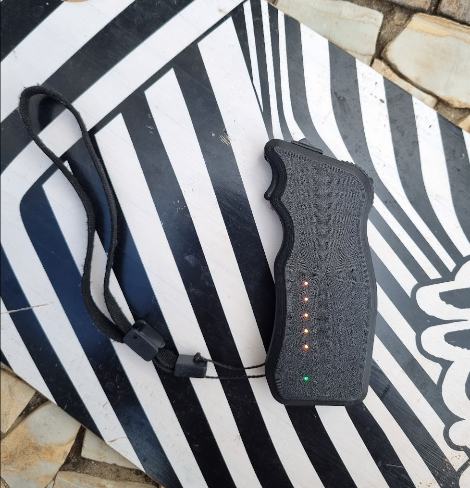
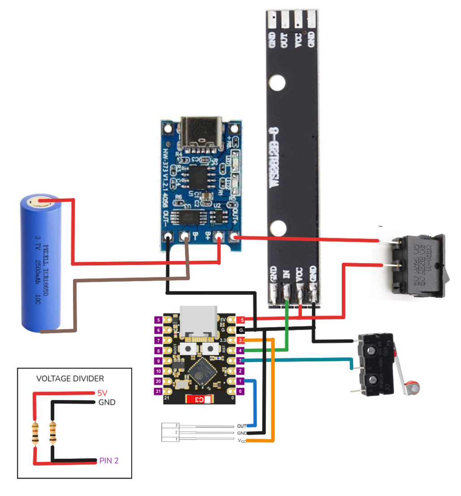
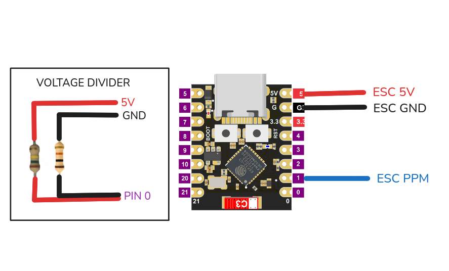

## ESP32 Skateboard Remote

This firmware implements an ESP-NOW based wireless remote for an electric skateboard. It supports **throttle control**, **deadman switch**, **battery monitoring** and **throttle calibration**.

---

### Features

- ESP-NOW wireless communication
- Throttle control with deadman switch
- Skateboard and remote battery display via NeoPixel LEDs
- Throttle calibration mode

---

### Hardware

The system consists of two devices:

- **Remote** – handheld controller with throttle input, battery monitoring, and LED indicators.
- **Receiver** – mounted on the skateboard and outputs a **PPM signal** to the ESC/VESC.

Both devices communicate wirelessly using **ESP-NOW**.

---

### Required Components

- **2× ESP32-C3 SuperMini** microcontrollers (remote + receiver)
- **49E Hall effect sensor** (throttle position sensing)
- **2× 5 mm neodymium magnets** (should oppose each other in the wheel)
- **Pen spring** (for throttle return mechanism)
- **8x16x5 bearing**
- **TP4056 charging module** (Li-ion charging and protection)
- **18650 Li-ion battery**
- **10T85 limit switch** (deadman switch)
- **8-LED WS2812 / NeoPixel module** (status and battery indicators)
- **KCD11 power switch**
- **Resistors for battery voltage divider**
- **4× M3 × 15 mm button head screws**
- [3D Printed parts](https://www.printables.com/model/1656323-esk8-remote-esp32-c3) (available on printables)

#### Antenna Fix

A lot of ESP32 C3 Mini models have connectivity problems due to antenna placement. They place it too close to other components, which kills signal. Rotating it helps get it away from that interference.

Unsolder the antenna, rotate it 90°, and solder it back like in the picture:

---

### Calibration Mode

Calibration allows adjusting throttle min, max, and center for better precision.

1. **Enter calibration mode**
    - Hold deadman while powering on (~8s)
    - Release when LEDs turn red

2. **Start**
    - Wait (LEDs off)
    - Press and hold deadman when LEDs turn white

3. **Max (forward)**
    - Hold full throttle forward and then let go of deadman (~5s)
    - Release throttle when LEDs blink green

4. **Min (brake)**
    - Hold full throttle back (~5s)
    - Press and release deadman
    - Release throttle when LEDs blink green

5. **Center**
    - Leave throttle centered (~5s)
    - Press and release deadman
    - Wait for confirmation
    - Press and release deadman

---

### LED Battery Indicators

- **Skateboard Battery (LEDs 0–4)**
    - Yellow → Red gradient and number of LEDs lit corresponds to battery level.

- **Remote Battery (LED 6)**
    - Red blinking if below `REMOTE_CRITICAL_V`
    - Gradient from Red → Green indicates charge

---

### Wiring

#### Remote

**Charging Module (TP4056)**

    B+ → Battery +
    B- → Battery -
    OUT+ → Power Switch → 5V
    OUT- → GND

**Hall Sensor (Throttle)**

    VCC → 3.3V
    GND → GND
    OUT → GPIO1 (THROTTLE_PIN)

**Deadman Switch**

    GND → GND
    NO → GPIO3 (DEADMAN_PIN)

**Remote Battery Voltage Divider**

    5V → [R1] → GPIO2 (REMOTE_BAT_PIN) → [R2] → GND

    (Example: R1 = 10k, R2 = 10k → ÷2)

**LED Module (WS2812)**

    DIN → GPIO4 (LED_PIN)
    VCC → 5V
    GND → GND

### Receiver

    GPIO1 (PPM_PIN) → PPM Signal
    GND → ESC GND
    5V -> ESC 5V

**Battery Voltage Divider**

    Battery + → [R1] → GPIO0 (BAT_PIN) → [R2] → GND
    (Example: R1 = 150k, R2 = 10k → ÷16)

